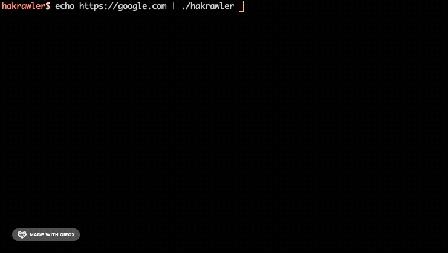

# Hakrawler

Fast golang web crawler for gathering URLs and JavaSript file locations. This is basically a simple implementation of the awesome Gocolly library.

## Example usage

```
cat urls.txt | hakrawler
```

## Example tool chain

Get all subdomains of google, find the ones that respond to http(s), crawl them all.

```
echo google.com | haktrails subdomains | httpx | hakrawler
```

## Usage gif



## Installation

First, you'll need to [install go](https://golang.org/doc/install).

Then run this command to download + compile hakrawler:
```
go get github.com/hakluke/hakrawler
```

You can now run `~/go/bin/hakrawler`. If you'd like to just run `hakrawler` without the full path, you'll need to `export PATH="/go/bin/:$PATH"`. You can also add this line to your `~/.bashrc` file if you'd like this to persist.

## Command-line options
```
  -d int
    	Depth to crawl. (default 2)
  -h string
    	Custom headers separated by semi-colon. E.g. -h "Cookie: foo=bar;Authorization: token"
  -insecure
    	Disable TLS verification.
  -t int
    	Number of threads to utilise. (default 8)
```

## Version 2 note

From version 2, hakrawler has been completely rewritten and dramatically simplified to align more closely with the unix philosophy.

- It is now much faster and less buggy.
- Many features have been deprecated (robots.txt parsing, JS file parsing, sitemap parsing, waybackurls), instead, these features are written into separate tools that can be piped to from hakrawler.
- No more terminal colours because they can cause annoying issues when piping to other tools.
- Version 1 was my first ever Go project and the code was bad.
