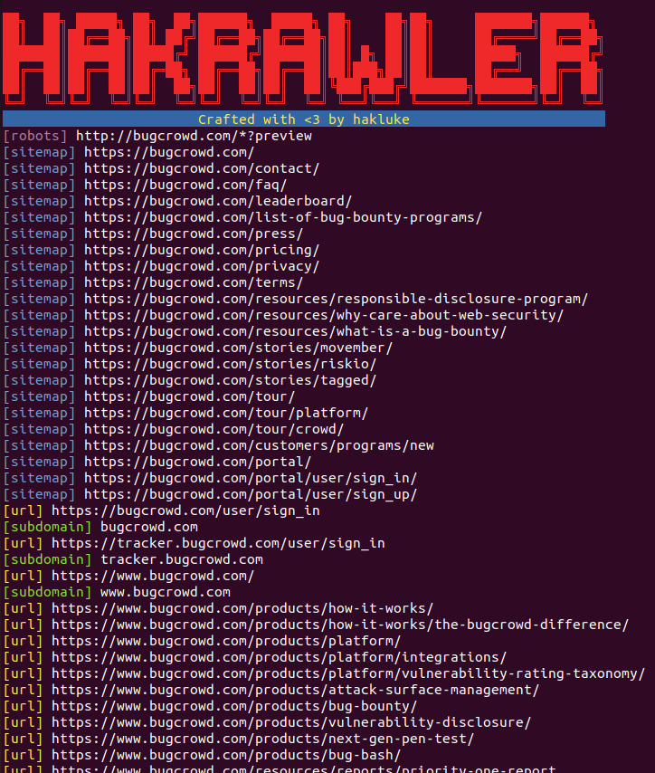

# hakrawler

[](https://twitter.com/hakluke)
[](https://github.com/hakluke/hakrawler)
[](https://www.gnu.org/licenses/gpl-3.0.en.html)  

## What is it?

hakrawler is a Go web crawler designed for easy, quick discovery of endpoints and assets within a web application. It can be used to discover:

- Forms
- Endpoints
- Subdomains
- Related domains
- JavaScript files

The goal is to create the tool in a way that it can be easily chained with other tools such as subdomain enumeration tools and vulnerability scanners in order to facilitate tool chaining, for example:

```
assetfinder target.com | hakrawler | some-xss-scanner
```

## Features

- Unlimited, fast web crawling for endpoint discovery
- Fuzzy matching for domain discovery
- robots.txt parsing
- sitemap.xml parsing
- Plain output for easy parsing into other tools
- Accept domains from stdin for easier tool chaining
- SQLMap-friendly output format
- Link gathering from JavaScript files

## Upcoming features

- Want more? [Submit a feature request](https://github.com/hakluke/hakrawler/issues/new)!

## Contributors
- [hakluke](https://twitter.com/hakluke) wrote the tool
- [cablej](https://cablej.io/) cleaned up the code
- [Corben Leo](https://github.com/lc) added in functionality to pull links from JavaScript files
- [delic](https://github.com/delic) made the code much cleaner
- [hoenn](https://github.com/hoenn) made the code even cleanerer
- [ameenmaali](https://twitter.com/ameenmaali) made a bunch of code improvements and bug fixes
- [daehee](https://github.com/daehee) added the -nocolor flag
- [robre](https://twitter.com/r0bre) added the -insecure flag

## Thanks

- [codingo](https://twitter.com/codingo_) and [prodigysml/sml555](https://twitter.com/sml555_), my favourite people to hack with. A constant source of ideas and inspiration. They also provided beta testing and a sounding board for this tool in development.
- [tomnomnom](https://twitter.com/tomnomnom) who wrote waybackurls, which powers the wayback part of this tool
- [s0md3v](https://twitter.com/s0md3v) who wrote photon, which I took ideas from to create this tool
- The folks from [gocolly](https://github.com/gocolly/colly), the library which powers the crawler engine
- [oxffaa](https://github.com/oxffaa/), who wrote a very efficient sitemap.xml parser which is used in this tool
- The contributors of [LinkFinder](https://github.com/GerbenJavado/LinkFinder) where some awesome regex was stolen to parse links from JavaScript files.

## Installation
1. Install Golang
2. Run the command below
```
go get github.com/hakluke/hakrawler
```
3. Run hakrawler from your Go bin directory. For linux systems it will likely be:
```
~/go/bin/hakrawler
```
Note that if you need to do this, you probably want to add your Go bin directory to your $PATH to make things easier!

## Usage
Note: multiple domains can be crawled by piping them into hakrawler from stdin. If only a single domain is being crawled, it can be added by using the -url flag.
```
$ hakrawler -h
Usage of hakrawler:
  -all
    	Include everything in output - this is the default, so this option is superfluous (default true)
  -auth string
    	The value of this will be included as a Authorization header
  -cookie string
    	The value of this will be included as a Cookie header
  -depth int
    	Maximum depth to crawl, the default is 1. Anything above 1 will include URLs from robots, sitemap, waybackurls and the initial crawler as a seed. Higher numbers take longer but yield more results. (default 1)
  -forms
    	Include form actions in output
  -js
    	Include links to utilised JavaScript files
  -linkfinder
    	Run linkfinder on javascript files.
  -outdir string
    	Directory to save discovered raw HTTP requests
  -plain
    	Don't use colours or print the banners to allow for easier parsing
  -robots
    	Include robots.txt entries in output
  -scope string
    	Scope to include:
    	strict = specified domain only
    	www  = specified domain and "www" subdomain
    	subs = specified domain and subdomains
    	yolo = everything (default "subs")
  -sitemap
    	Include sitemap.xml entries in output
  -subs
    	Include subdomains in output
  -url string
    	The url that you wish to crawl, e.g. google.com or https://example.com. Schema defaults to http
  -urls
    	Include URLs in output
  -usewayback
    	Query wayback machine for URLs and add them as seeds for the crawler
  -v	Display version and exit
  -wayback
    	Include wayback machine entries in output
  -insecure
      Ignore SSL verification
```

## Basic Example

Command: `hakrawler -url bugcrowd.com -depth 1`


